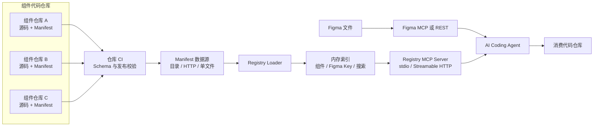
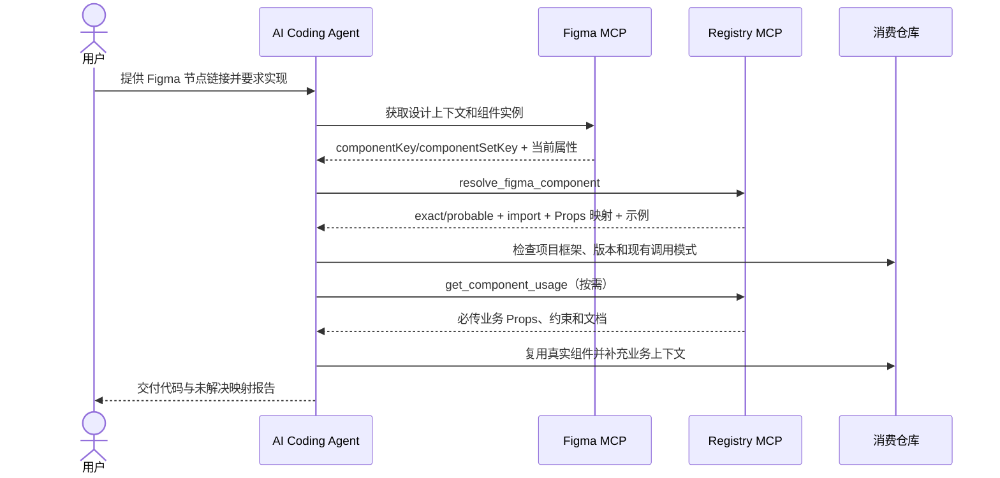

# 统一组件 Registry MCP Server 技术方案

## 1. 文档信息

| 项目 | 内容 |
| --- | --- |
| 方案版本 | v1.0 |
| 文档状态 | 可评审、已有 MVP 实现 |
| 适用范围 | 多仓库、多团队共享的前端组件库与业务组件库 |
| 目标读者 | 组件库团队、设计系统团队、平台团队、AI Coding 平台团队、业务研发团队 |
| 更新时间 | 2026-08-13 |

## 2. 方案摘要

建设一个集中式、只读的 Component Registry MCP Server，为 AI Coding Agent 提供统一的组件发现与解析能力。

每个组件仓库维护一份版本化 Manifest，声明：

- 组件的全局唯一 ID、名称、负责人和状态；
- Figma `componentSetKey`、Variant `componentKey` 及属性定义；
- 对应代码包、导入路径、Export 名称和版本；
- Figma 属性到代码 Props 的映射；
- 必传 Props、示例代码、使用约束和文档地址。

Registry MCP 聚合多个仓库的 Manifest，构建内存索引，并向 AI Agent 暴露搜索、详情、Figma 身份解析和代码用法查询工具。AI Agent 同时调用 Figma MCP 与 Registry MCP：前者读取设计上下文，后者识别真实代码组件。两个 MCP Server 不直接互调。

该方案可以在内部 AI Coding 工作流中替代 Code Connect 的“组件识别与复用”部分，但不替代 Figma Dev Mode 代码片段展示、官方托管映射或其他 Code Connect 产品能力。

## 3. 背景与问题

当前组件资产分布在多个代码仓库中，由不同团队维护。AI Coding Agent 收到 Figma Link 后，即使能从设计稿识别出组件名称和 Variant，也无法天然知道：

1. 对应哪个 npm 包和 Export；
2. 应使用哪个版本与导入路径；
3. Figma Variant 值如何映射为代码 Props；
4. 哪些参数来自设计稿，哪些必须由业务应用注入；
5. 组件是否已废弃、由谁维护、有哪些使用约束；
6. 同名组件在多个仓库中出现时，哪个才是正确实现。

只让 Agent 搜索本地仓库存在以下问题：

- 消费仓库通常没有全部共享组件源码；
- 名称相同不代表语义相同；
- Figma 名称与代码 Export 名称可能不同；
- 模型容易重新拼装基础组件，而不是复用已有业务组件；
- 多团队无法统一处理组件版本、废弃状态和映射冲突。

Code Connect 能解决官方 Figma 环境内的映射问题，但其计划和 Seat 要求较高，也无法完全覆盖企业内部的多仓库治理、私有组件元数据和业务接入要求。因此需要一套由企业自己控制的确定性映射层。

## 4. 建设目标

### 4.1 核心目标

1. 通过稳定 Figma 身份确定性定位代码组件。
2. 为所有团队提供一个统一、只读、可审计的组件查询入口。
3. 支持多个组件仓库、多个前端框架和多个代码实现。
4. 显式维护 Figma 属性、Variant 值与代码 Props 的映射。
5. 让 Agent 能区分设计属性与业务运行时参数。
6. 在组件仓库发布流程中自动验证映射完整性与全局冲突。
7. 在中心服务刷新失败时继续提供最后一次正确数据。
8. 同时支持本地 stdio 调试和中心 Streamable HTTP 部署。

### 4.2 非目标

首期不包含以下能力：

- 不在 Figma Dev Mode 中显示生产代码片段；
- 不创建或修改 Figma Component、Variant 或 Code Connect 映射；
- 不让 Registry Server 直接调用 Figma MCP；
- 不执行 Manifest 中的代码示例；
- 不自动修改消费仓库代码；
- 不替代 npm Registry、制品库或组件文档站点；
- 不在首期引入独立数据库和管理后台。

## 5. 核心设计原则

1. **稳定身份优先**：优先使用 `componentKey` 和 `componentSetKey`，名称只用于搜索和兜底。
2. **确定性优先**：任何 Figma 值到代码值的转换都由显式映射定义，不交给模型猜测。
3. **仓库自治**：组件元数据由组件所属仓库维护，与代码一起评审和发布。
4. **中心聚合**：消费方只连接一个 Registry MCP，不需要克隆所有组件仓库。
5. **只读安全**：Registry 只读取管理员配置的数据源，不接受调用方传入任意文件路径或 URL。
6. **失败保守**：冲突或歧义必须显式返回，不自动选择“看起来最像”的结果。
7. **渐进接入**：允许名称兜底，但必须标记为 `probable`，稳定映射返回 `exact`。
8. **协议可演进**：Manifest 使用 `schemaVersion`，支持未来兼容升级。

## 6. 总体架构



### 6.1 职责边界

| 模块 | 职责 | 不负责 |
| --- | --- | --- |
| Figma MCP/REST | 读取设计节点、组件身份、当前属性和视觉上下文 | 判断企业代码组件在哪里 |
| Registry MCP | 将 Figma 身份解析为代码实现，返回 Props、Import、示例和约束 | 读取或修改 Figma 画布 |
| AI Coding Agent | 编排两个 MCP，根据项目上下文生成最终代码 | 维护 Registry 权威数据 |
| 组件仓库 | 维护组件源码和 Manifest，发布版本 | 聚合其他团队组件 |
| 中心平台 | 部署 Registry、配置来源、认证、监控和可用性保障 | 替组件团队维护业务语义 |

## 7. 核心业务流程

### 7.1 Figma 到代码的解析流程



### 7.2 组件接入流程

1. 组件团队在组件仓库中新增或更新 Manifest。
2. 设计团队提供 Figma Component Set 链接。
3. 工具读取 `componentSetKey`、全部 Variant `componentKey` 和属性定义。
4. 组件团队确认哪些 Figma 属性对应公开代码 Props，哪些仅是内部展示状态。
5. CI 验证单仓库 Manifest。
6. 聚合 CI 验证跨仓库全局 ID 和稳定 Figma Key 冲突。
7. 发布流程将 Manifest 上传到中心目录或内部 HTTP 地址。
8. Registry 定时刷新并原子替换内存索引。

## 8. Manifest 数据协议

### 8.1 顶层结构

```ts
interface RegistryManifest {
  schemaVersion: 1;
  source: {
    id: string;
    repositoryUrl?: string;
    revision?: string;
    generatedAt?: string;
  };
  components: RegistryComponent[];
}
```

`source.id` 表示 Manifest 所属仓库或发布单元；`revision` 建议填写 npm 版本、Git Tag 或 Commit SHA。

### 8.2 组件结构

```ts
interface RegistryComponent {
  id: string;
  name: string;
  displayName?: string;
  description: string;
  kind: "primitive" | "business" | "pattern" | "data-display" | "layout";
  status: "experimental" | "beta" | "stable" | "deprecated";
  tags: string[];
  owners: string[];
  defaultImplementationId?: string;
  figmaBindings: FigmaBinding[];
  implementations: ComponentImplementation[];
  documentation: DocumentationEntry[];
}
```

约束：

- `id` 必须为不可变、全局唯一的小写 Slug，例如 `gzd/pcs/valuation-log-data-chart`；
- `id` 不包含版本号；
- 每个组件至少有一个代码实现；
- `defaultImplementationId` 必须指向当前组件中的有效实现；
- 同一组件可同时提供 React、Vue、SwiftUI 等多个实现。

### 8.3 Figma Binding

```ts
interface FigmaBinding {
  componentKey?: string;
  componentSetKey?: string;
  fileKey?: string;
  nodeId?: string;
  componentName?: string;
  aliases: string[];
  variants: Array<{
    componentKey: string;
    nodeId?: string;
    properties: Record<string, string | number | boolean | null>;
  }>;
  propertyMappings: Record<string, FigmaPropertyMapping>;
}
```

身份使用优先级：

1. Variant `componentKey`；
2. Component Set `componentSetKey`；
3. `fileKey/nodeId`；
4. `componentName`；
5. `aliases`；
6. Registry 组件名称。

`fileKey` 与 `nodeId` 必须成对出现。组件在 Figma Library 迁移后可能改变文件与节点位置，因此它们不能替代稳定 Key。

### 8.4 属性映射

```ts
interface FigmaPropertyMapping {
  codeProp?: string;
  type?: "VARIANT" | "BOOLEAN" | "TEXT" | "INSTANCE_SWAP" | "SLOT";
  values?: Record<string, string | number | boolean | null>;
  ignore?: boolean;
  description?: string;
}
```

示例：

```json
{
  "mode": {
    "codeProp": "mode",
    "type": "VARIANT",
    "values": {
      "fixedSingle": "fixedSingle",
      "multiple": "multiple"
    }
  },
  "status": {
    "type": "VARIANT",
    "ignore": true,
    "description": "组件内部状态，不属于公开 React Props。"
  }
}
```

规则：

- 未设置 `ignore: true` 时必须提供 `codeProp`；
- `ignore: true` 与 `codeProp` 互斥；
- `codeProp` 必须存在于所选实现的 Props 列表中；
- `values` 存在时，未声明的 Figma 值不得被自动透传；
- 多个 Figma 属性映射到同一代码 Prop 时返回警告。

### 8.5 代码实现结构

```ts
interface ComponentImplementation {
  id: string;
  framework: string;
  language: string;
  package: {
    name: string;
    version: string;
    exportPath?: string;
  };
  import: {
    specifier: string;
    exportName: string;
    kind: "named" | "default" | "namespace";
    styleImports: string[];
  };
  source: {
    path: string;
    repositoryUrl?: string;
  };
  props: ComponentProp[];
  examples: ComponentExample[];
  requirements: string[];
}
```

Manifest 中的示例只作为文本上下文返回，Registry 不执行任何示例代码。

## 9. 身份解析算法

### 9.1 匹配评分

当前实现使用以下权重：

| 证据 | 分数 | 置信度 |
| --- | ---: | --- |
| Variant `componentKey` | 10000 | `exact` |
| `componentSetKey` | 9000 | `exact` |
| `fileKey/nodeId` | 8000 | `exact` |
| `componentName` | 500 | `probable` |
| Alias | 450 | `probable` |
| Registry 名称 | 400 | `probable` |

同一组件的多个证据可以累加，但名称证据不能把结果提升为 `exact`。

### 9.2 返回状态

| 状态 | 含义 | Agent 行为 |
| --- | --- | --- |
| `matched` + `exact` | 稳定身份唯一命中 | 必须复用 Registry 返回的真实组件 |
| `matched` + `probable` | 仅名称或别名命中 | 作为候选，必要时要求确认并报告缺失稳定 Key |
| `ambiguous` | 多个候选同分 | 不生成确定性组件调用，补充稳定身份 |
| `conflict` | 输入的多个稳定 Key 指向不同组件 | 停止实现并修复 Registry 或设计稿 |
| `not_found` | 没有匹配 | 可搜索相似组件，但不能声称已有确定映射 |

### 9.3 Variant 属性推导

当调用方只提供具体 Variant `componentKey` 时，Registry 从 `variants[].properties` 中恢复其完整 Figma 属性，再与调用方显式传入的 `variantProperties` 合并。调用方数据优先，用于反映实例覆盖值。

随后执行：

1. 去除 Figma 属性名中可能存在的 `#唯一ID` 后缀进行兼容匹配；
2. 查找对应 `propertyMappings`；
3. 忽略声明为内部状态的属性；
4. 通过 `values` 转换枚举值；
5. 验证目标 `codeProp` 是否存在；
6. 返回 `mappedProps`、`unmappedProperties`、`ignoredProperties` 和 `warnings`；
7. 根据实现的 Props 定义计算 `missingRequiredProps`；
8. 生成只包含已映射设计 Props 的参考 JSX。

## 10. MCP 接口设计

### 10.1 Tools

| Tool | 主要输入 | 主要输出 |
| --- | --- | --- |
| `get_registry_status` | 无 | 来源状态、组件数量、稳定映射数、警告、最后加载时间 |
| `search_components` | query、tags、owner、framework、language、kind、status | 排序后的组件摘要 |
| `get_component` | componentId | 完整组件记录、Figma Binding、实现、文档 |
| `resolve_figma_component` | Figma 身份、当前属性、框架偏好 | 状态、置信度、证据、实现、Props 映射、Import、示例 |
| `get_component_usage` | componentId、实现偏好、可选 Figma 身份 | 指定组件的完整使用上下文 |
| `reload_registry` | 无 | 刷新后的 Registry 状态 |

所有工具均为只读工具，并声明：

```ts
{
  readOnlyHint: true,
  destructiveHint: false,
  idempotentHint: true
}
```

`reload_registry` 会访问管理员配置的外部数据源，因此其 `openWorldHint` 为 `true`；其他本地查询为 `false`。

### 10.2 Resource

提供固定资源：

```text
registry://components/catalog
```

资源内容包含 Registry 当前状态和所有组件摘要，适合支持 MCP Resource 的客户端预加载目录。

### 10.3 Prompt

提供 `implement-from-figma-with-registry` Prompt，规定 Agent：

1. 先读取 Figma 结构化上下文；
2. 为每个未 Detach 的组件实例调用 Registry；
3. 对 `exact` 结果禁止重复实现；
4. 将 `probable` 结果作为候选而非事实；
5. 从业务应用上下文补充 `missingRequiredProps`。

## 11. 服务内部模块

| 模块 | 文件 | 职责 |
| --- | --- | --- |
| Schema | `src/schema.ts` | Zod 数据模型、默认值、跨字段校验 |
| Loader | `src/loader.ts` | 加载文件、目录和 HTTP 数据源 |
| Registry | `src/registry.ts` | 构建索引、搜索、身份解析和 Props 映射 |
| Store | `src/store.ts` | 刷新、并发合并、最后正确版本和状态管理 |
| MCP | `src/mcp.ts` | 注册 Tools、Resource、Prompt 和结果结构 |
| HTTP | `src/http.ts` | Streamable HTTP、健康检查、认证和 Host 限制 |
| CLI | `src/cli.ts` | `stdio`、`http`、`validate` 启动命令 |

## 12. 数据源与刷新策略

### 12.1 支持的数据源

| 类型 | 用途 |
| --- | --- |
| `file` | 本地开发或单一聚合 Manifest |
| `directory` | 中心服务器挂载多个团队 Manifest |
| `http` | 从内部制品服务或静态资源服务读取 Manifest |

HTTP Header 不直接写入配置，使用 `headersFromEnv` 引用环境变量，避免凭据进入仓库。

### 12.2 刷新流程

1. 到达 `refreshIntervalSeconds` 或收到 `reload_registry` 请求；
2. 并行加载所有配置来源；
3. 对每份 Manifest 执行 Schema 校验；
4. 构建一份全新的 `ComponentRegistry`；
5. 检查全局组件 ID、Component Key 和 Component Set Key 冲突；
6. 全部成功后原子替换当前 Registry；
7. 必需来源失败时保留上一次正确 Registry；
8. 可选来源失败时跳过该来源，并在状态中记录警告。

首次启动时没有可用旧版本，因此任何必需来源失败都必须阻止服务进入 Ready 状态。

## 13. 搜索策略

搜索字段包括：

- 全局组件 ID；
- 代码组件名和展示名；
- Figma Component 名；
- Alias；
- Tags；
- Owners；
- Framework 和 Language。

精确 ID 和名称获得最高搜索权重，其次为完整 Alias、前缀和子串匹配。搜索用于发现候选组件，不改变 Figma 身份解析的置信度规则。

首期使用内存字符串索引。对于数千级组件，该方案足够简单且响应稳定；达到数万组件或需要自然语言语义检索时，再评估倒排索引或向量检索。向量结果仍只能用于候选发现，不能替代稳定身份匹配。

## 14. 部署方案

### 14.1 本地开发模式

使用 stdio，由 MCP Client 直接启动进程：

```bash
node dist/cli.js stdio --config /absolute/path/registry.config.json
```

适合：

- 组件团队本地维护和验证 Manifest；
- 无中心网络条件的开发环境；
- MCP Inspector 或单机 Agent 调试。

### 14.2 中心服务模式

使用无状态 Streamable HTTP：

```bash
node dist/cli.js http \
  --config /etc/component-registry/registry.config.json \
  --host 0.0.0.0 \
  --port 7345 \
  --allowed-host components.example.internal \
  --auth-token-env COMPONENT_REGISTRY_HTTP_TOKEN
```

推荐拓扑：

```text
MCP Client
  -> 企业 API Gateway / OAuth Proxy / TLS
  -> Registry MCP Pod
  -> 只读 Manifest Volume 或内部 HTTP 制品服务
```

服务提供：

- `POST /mcp`：MCP 请求；
- `GET /health`：Ready 状态与组件数量。

### 14.3 容器化

使用多阶段 Docker 构建：

- Build 阶段安装完整依赖并编译 TypeScript；
- Runtime 阶段仅安装生产依赖；
- 使用非 Root `node` 用户运行；
- Manifest 目录以只读 Volume 挂载；
- 不在镜像中写入 Token 或远程 Header。

## 15. 安全设计

### 15.1 权限与网络

- Registry 对组件数据完全只读；
- HTTP 模式支持 Bearer Token；
- Token 比较使用定时安全比较，降低时序侧信道风险；
- 通过 `allowedHosts` 防止非预期 Host Header 和本地 DNS Rebinding；
- 生产环境必须使用 TLS，并优先由企业 Gateway 承担 OAuth、审计和限流；
- 未启用认证时禁止把 `0.0.0.0` 直接暴露到非可信网络。

### 15.2 数据源安全

- MCP 调用方不能传入数据源 URL 或文件路径；
- 文件和远程地址只能由服务管理员在配置文件中声明；
- HTTP 凭据只通过环境变量读取；
- 远程来源设置超时，避免请求长期占用；
- Manifest 中的代码示例仅按字符串返回，绝不执行或动态 Import；
- 部署层应限制出站网络，只允许访问已批准的内部 Manifest 域名。

### 15.3 供应链治理

- Manifest 由组件仓库 CI 生成或评审；
- 聚合 CI 对所有 Manifest 进行全局冲突检查；
- 发布产物建议带 Git SHA、版本和校验和；
- 中心服务只消费可信制品源；
- npm 包版本与 Manifest `revision` 应能够追溯到同一次发布。

## 16. 高可用与容错

| 故障 | 处理策略 |
| --- | --- |
| 必需来源首次加载失败 | 启动失败，健康检查返回非 Ready |
| 必需来源刷新失败 | 保留最后一次正确 Registry，记录 `lastError` |
| 可选来源失败 | 跳过该来源并记录警告 |
| Manifest Schema 错误 | 拒绝本次刷新，不污染当前索引 |
| 全局 ID 或稳定 Key 冲突 | 拒绝构建新 Registry |
| 单个查询无匹配 | 返回 `not_found`，不抛服务级异常 |
| 多候选同分 | 返回 `ambiguous`，要求补充身份 |
| 多个稳定身份冲突 | 返回 `conflict`，阻止 Agent 自动选择 |

中心服务无会话状态，可通过多个副本横向扩展。各副本从相同版本化来源加载数据即可，无需共享运行时数据库。

## 17. 可观测性

### 17.1 当前能力

`get_registry_status` 和 `/health` 已提供：

- Ready 状态；
- 当前加载代次；
- 组件数量；
- Manifest 数量；
- 稳定 Figma Binding 数量；
- 最后尝试加载时间；
- 最后成功加载时间；
- 最后错误；
- 每个数据源状态和警告。

### 17.2 生产增强建议

中心部署时增加以下指标：

- `registry_components_total`；
- `registry_stable_figma_bindings_total`；
- `registry_refresh_success_total` / `registry_refresh_failure_total`；
- `registry_refresh_duration_seconds`；
- `registry_resolve_total{status,confidence}`；
- `registry_tool_duration_seconds{tool}`；
- `registry_source_age_seconds{source}`。

日志中记录请求 ID、Tool 名、结果状态、耗时和 Registry Generation；不得记录 Token 或其他认证信息。

## 18. CI/CD 与治理

### 18.1 组件仓库 CI

每个组件仓库至少执行：

1. JSON Schema 校验；
2. Zod 运行时校验；
3. Component ID 与实现 ID 唯一性检查；
4. `defaultImplementationId` 引用检查；
5. `codeProp` 是否存在于 Props 中；
6. npm 包版本、Export 和文档路径检查；
7. Figma Variant 值映射完整性检查。

### 18.2 聚合 CI

聚合所有团队 Manifest 后执行：

```bash
npm ci --legacy-peer-deps
npm run build
node dist/cli.js validate --config /path/to/ci-registry.config.json
npm test
```

聚合校验重点检测：

- 全局组件 ID 冲突；
- `componentKey` 冲突；
- `componentSetKey` 冲突；
- `fileKey/nodeId` 冲突；
- 必需数据源缺失；
- Schema 版本不兼容。

### 18.3 所有权与变更流程

- `owners` 至少包含一个团队标识；
- 稳定 Figma Key 变更需要设计系统 Owner 与组件 Owner 共同评审；
- 组件废弃时使用 `status: deprecated`，保留旧 ID 和迁移说明，不立即删除；
- 破坏性 Props 变更必须先发布新代码版本，再更新 Manifest；
- 同一设计组件对应多框架实现时，使用多个 `implementations`，不得复制多个全局组件 ID。

## 19. 版本演进

### 19.1 Manifest Schema

- `schemaVersion: 1` 表示当前协议；
- 向后兼容字段可作为 Optional 增加；
- 删除字段、改变含义或枚举值时提升主版本；
- Registry Server 在不支持 Schema 版本时拒绝加载，并保留旧索引。

### 19.2 组件与实现版本

- 全局 `component.id` 不随包版本变化；
- `package.version` 表示 Agent 推荐安装或校验的版本；
- `source.revision` 用于追溯 Manifest 发布批次；
- 将来可扩展 SemVer Range 与兼容矩阵，但首期推荐精确版本。

## 20. 测试方案

### 20.1 单元测试

- 稳定 Key 精确解析；
- 名称匹配只返回 `probable`；
- Variant Key 自动恢复属性；
- 未映射 Variant 值不被猜测；
- 内部状态属性被正确忽略；
- 必传 Props 正确进入 `missingRequiredProps`；
- 重复稳定身份阻止 Registry 构建。

### 20.2 协议测试

- 使用 MCP 内存 Transport 验证 Tool 列表与调用结果；
- 验证 `structuredContent` 与文本返回一致；
- 验证真实 Variant Key 能通过 MCP 返回 `exact`。

### 20.3 HTTP 端到端测试

- 启动随机本地端口；
- 使用 Streamable HTTP MCP Client 完成连接和 Tool 调用；
- 验证健康检查和 Registry 状态；
- 后续增加无 Token、错误 Token、错误 Host 与超时测试。

当前实现已通过 3 个测试文件、7 项测试，以及 TypeScript 类型检查、构建、运行时 Manifest 和 JSON Schema 校验。

## 21. 性能估算

当前索引结构：

- `componentId -> component`：Hash Map；
- `componentKey -> binding`：Hash Map；
- `componentSetKey -> binding`：Hash Map；
- `fileKey/nodeId -> binding`：Hash Map；
- 名称搜索：遍历组件摘要并按权重排序。

稳定身份解析平均复杂度为 O(1)。名称搜索为 O(n)，在数千级组件范围内可接受。所有查询只读取内存，不会在每次 Tool 调用时读取组件仓库或远程来源。

当组件规模达到数万级后，可增加预计算名称倒排索引；无需改变 MCP 接口和 Manifest 协议。

## 22. 备选方案比较

| 方案 | 优点 | 缺点 | 结论 |
| --- | --- | --- | --- |
| 全量使用 Code Connect | Figma 官方集成、Dev Mode 体验完整 | Plan/Seat 成本较高，内部治理扩展受限 | 核心组件可选择性使用，不作为唯一方案 |
| Agent 直接搜索代码仓库 | 无额外服务 | 无法覆盖未克隆仓库，名称匹配不确定 | 不采用 |
| 仅按 Figma 名称映射 | 实现简单 | 重命名、同名、别名都会产生错误 | 只作为兜底 |
| 中心数据库人工录入 | 查询和管理能力强 | 需要后台、权限、同步和双写治理 | 首期不采用 |
| Git Manifest + 中心 MCP | 可审计、仓库自治、易接入 CI、成本可控 | 需要维护协议和发布流程 | 采用 |

## 23. 实施计划

### 阶段一：MVP 与单仓库验证

- 完成 Manifest Schema、Loader、内存索引和 MCP Tools；
- 支持 stdio 和本地文件来源；
- 接入 gzd 两个 PCS-定价管理业务组件；
- 验证 `IndicativePricingforSelectedContracts` 的 Component Set 和 11 个 Variant Key。

状态：已完成。

### 阶段二：中心服务与多仓库接入

- 部署 Streamable HTTP 服务；
- 接入企业 Gateway/OAuth、TLS 和日志平台；
- 建立中心 Manifest 目录或制品 HTTP 地址；
- 选择 2～3 个组件团队试点；
- 在消费仓库配置统一 MCP 地址和 AI Coding 规则。

### 阶段三：发布自动化与治理

- 为组件仓库提供 Manifest 模板和 CI Action；
- 从 TypeScript 类型或 API 文档半自动生成 Props 清单；
- 增加 Figma Key 漂移与 Variant 覆盖率检查；
- 建立 Owner、废弃、版本兼容和变更评审制度。

### 阶段四：规模化与质量度量

- 接入全部共享业务组件仓库；
- 建立匹配率、`exact` 覆盖率和组件复用率指标；
- 对高频 `not_found` 和 `probable` 结果建立补录流程；
- 根据规模评估倒排索引、缓存持久化和管理界面。

## 24. 验收标准

### 24.1 功能验收

- 能聚合至少三个不同仓库的 Manifest；
- 能通过 Component Set Key 和 Variant Key 精确解析组件；
- 能返回正确的 npm 包、Import、Export、Props 和示例；
- 能区分设计 Props 与业务必传 Props；
- 名称匹配只能返回 `probable`；
- 冲突和歧义不会被自动忽略；
- 数据源刷新失败时保留最后正确版本；
- stdio 与 Streamable HTTP 客户端均可正常调用。

### 24.2 非功能验收

- 稳定身份查询 P95 小于 100ms，不含网络接入层耗时；
- 单份错误 Manifest 不会污染当前服务数据；
- 生产 HTTP 入口具备认证、TLS、Host 限制和审计日志；
- Manifest 和代码版本可追溯到同一发布记录；
- 组件 Owner 能在自己的仓库中独立维护元数据。

### 24.3 业务效果验收

- 试点 Figma 任务中的已有业务组件识别率达到 90% 以上；
- 已建立稳定映射的组件 `exact` 命中率达到 100%；
- Agent 不再对 `exact` 命中组件重复拼装基础组件；
- 因名称误判导致的错误组件选型可被 Registry 冲突/歧义机制阻断。

## 25. 风险与应对

| 风险 | 影响 | 应对措施 |
| --- | --- | --- |
| Manifest 与代码不同步 | Agent 生成过时代码 | 将 Manifest 校验纳入组件发布流水线 |
| Figma 组件被重建导致 Key 变化 | `exact` 命中失败 | 监控 `probable/not_found`，建立 Key 变更评审和更新流程 |
| 团队只维护名称映射 | 匹配不稳定 | 将稳定映射覆盖率纳入质量指标 |
| 多团队声明同一 Key | 解析冲突 | 聚合 CI 和运行时构建阶段双重拒绝 |
| HTTP Manifest 来源不可用 | Registry 数据无法刷新 | 必需/可选来源分级和最后正确版本策略 |
| Registry 服务被非授权访问 | 暴露内部组件资产 | Gateway/OAuth、TLS、Bearer、网络隔离 |
| 示例代码被误当成可执行代码 | 安全或质量问题 | 服务只返回字符串，Agent 仍需结合消费仓库审查 |
| 组件数量增长导致搜索变慢 | Tool 响应延迟 | 保持稳定 Key Hash 索引，按规模增加倒排索引 |

## 26. 当前实现状态

当前仓库已具备：

- 独立 Node.js/TypeScript MCP Server；
- 文件、目录、HTTP 三类数据源；
- stdio 与 Streamable HTTP；
- Bearer Token、Host 限制和健康检查；
- Zod Runtime Schema 与 JSON Schema；
- 搜索、详情、Figma 解析、用法查询、状态和刷新 Tools；
- Catalog Resource 与标准工作流 Prompt；
- 最后正确版本刷新策略；
- Dockerfile、配置示例、中文使用文档和自动化测试。

gzd 当前组件覆盖：

| 组件 | Figma 状态 | Registry 结果 |
| --- | --- | --- |
| `IndicativePricingforSelectedContracts` | 已登记 Component Set Key 与 11 个 Variant Key | `exact` |
| `ValuationLogDataChart` | 暂无 Figma 链接，仅名称与 Alias | `probable` |

## 27. 待决策事项

在进入中心部署前，需要确认：

1. Registry 服务由组件平台、AI Coding 平台还是基础设施团队负责运行；
2. 中心 Manifest 使用制品目录、对象存储还是内部 HTTP 服务；
3. 认证统一使用企业 OAuth，还是先以 Gateway 管理的服务 Token 试点；
4. 各组件团队的 Owner 标识和审批人格式；
5. Manifest 与 npm 发布的强制绑定策略；
6. 首批试点仓库和消费项目；
7. `exact` 覆盖率、识别率和重复实现率的统计口径。

## 28. 结论

统一组件 Registry MCP 通过“仓库自治 Manifest + 中心只读聚合 + 稳定 Figma 身份解析”，为多仓库、多团队环境提供了一条成本可控、可审计、可渐进推广的 AI Coding 组件复用链路。

其关键不是让模型更聪明地猜组件，而是把 Figma 设计身份与生产代码实现之间的关系变成显式、版本化、可验证的工程协议。只要设计组件保持 Instance 关联、组件仓库持续维护 Manifest，AI Agent 就能够在不依赖全面 Code Connect 部署的情况下稳定复用企业业务组件。

## 29. 相关资料

- [Registry MCP 使用与部署文档](../tools/component-registry-mcp/README.md)
- [Manifest JSON Schema](../tools/component-registry-mcp/schemas/manifest.schema.json)
- [Registry 配置 JSON Schema](../tools/component-registry-mcp/schemas/config.schema.json)
- [gzd 组件 Manifest](../component-registry/gzd.registry.json)
- [多仓库配置示例](../tools/component-registry-mcp/examples/multi-repository.config.json)
